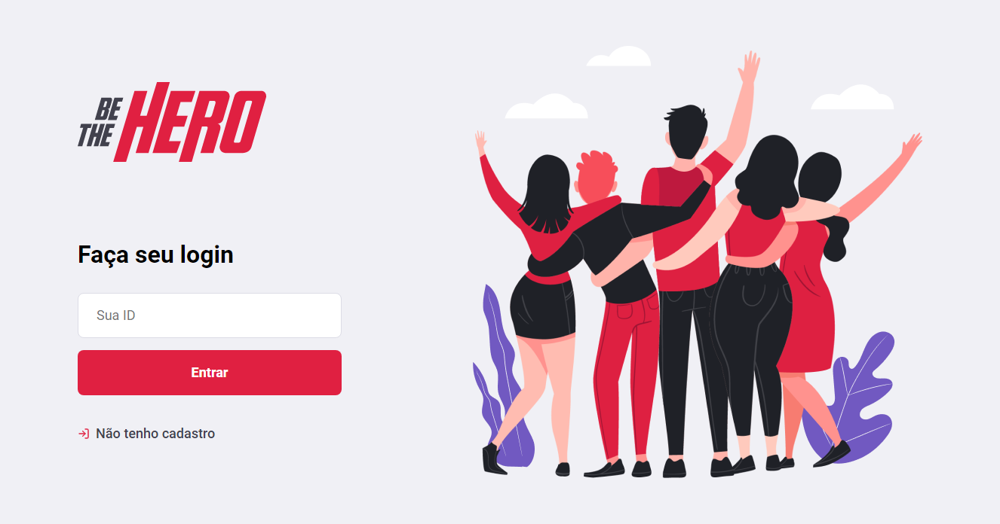

## BE THE HERO

      
      
      
      
      

## Scripts disponiveis

No diretorio desse projeto você pode usar:

### `yarn start & npm start`

Roda o app em modo desenvolvedor. 

Projeto feito durante a Next Lvl Week da Rocketseat.
